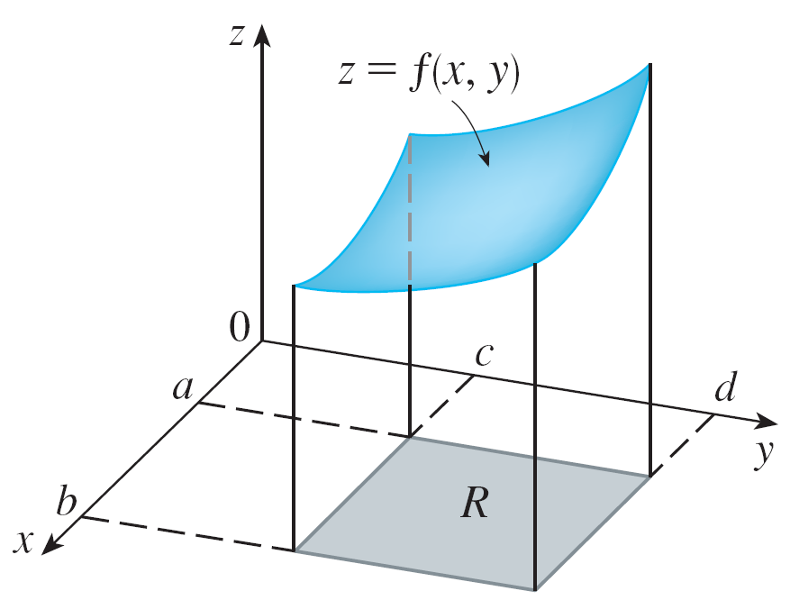
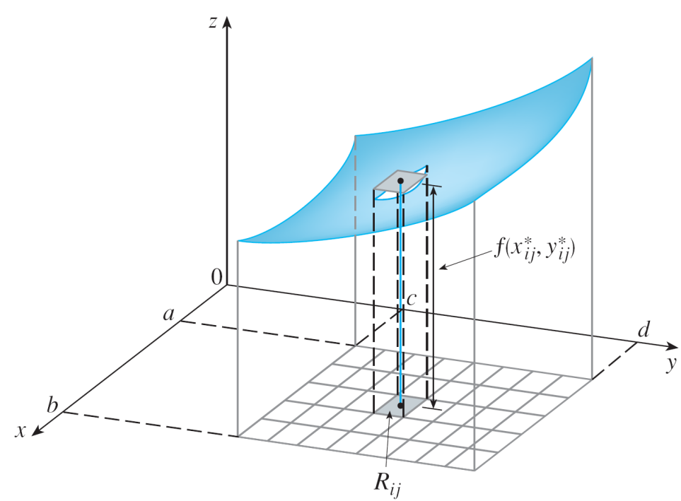

<!-- foo 
Highlighting
bold
strong
orange <b style="color:#d95f02"> text </b>
green  <b style="color:#1b9e77"> text </b>
purple <b style="color:#d24693"> text </b>
red    <b style="color:#FF0000"> text </b>
blue   <b style="color:#0000FF"> text </b>
-->

15.1 Double Integrals Over Rectangles
========================================================
title: "Math 283 Calculus 3"
date: Math 283 Spring 2020
author: Claudia Castro-Castro
autosize: true
incremental: true
width: 1920
height: 1080

<h2 style="text-align:left"> Instructions:</h2>

Use the left and right arrow keys to navigate the presentation forward and backward respectively.  You can also use the arrows at the bottom right of the screen to navigate with a mouse. 

    Copyright Disclaimer under section 107 of the Copyright Act 1976, allowance is made for “fair use” for purposes such as criticism, comment, news reporting, teaching, scholarship, education and research

========================================================

## Calculus in the time of Covid-19

<small>
Courtesy of Pixabay
</small>

 
<ul style="list-style-type:none;">
<li>"He would receive his bachelor's degree in 1665, the year of the last great outbreak of the bubonic plage in England. Plague spreads under crowded, unsanitary conditions--and this was sufficiently well recognized that the court of King Charles II departed London for Oxfordshire, and Cambridge University closed. Issac Newton chose to return to his childhood home in Woolsthorpe-- and spend the next eighteen months "minding Mathematics and Philosophy". In so doing, he remade the world."
 
 
<em>James D. Stein, Cosmic Numbers, 2011</em>
</li>
</ul>

========================================================

## Outline

<!-- foo -->

* The following topics will be covered in this lecture:

  * Review of Double Integrals/Iterated  integrals
  * Examples of Iterated integrals
  * Fubini's Theorem
  * Average value
  * Properties of Double integrals

========================================================

## Volumes and Double Integrals
* Consider a function $f(x,y)$ of two variables defined on a closed rectangle

  $$R=[a,b]\times[c,d]=\{(x,y)|a\leq x \leq b, c \leq y \leq d\}$$
  
* $S$ be the solid that lies above $R$ and under the graph of $f$  
  

<small>
Courtesy of James Stewart, <em>Calculus: Early transcendentals</em>, 2nd edition
</small>

 
<ul style="list-style-type:none;">
<li>$\star$ Our <b>goal</b> is to find the <strong>volume </strong> of $S$</li>
</ul>

  
========================================================

## Volumes and Double Integrals

<small>
Courtesy of James Stewart, <em>Calculus: Early transcendentals</em>, 2nd edition
</small>

<ul> 
<li> The first step is to take a <strong> partition</strong> of $R$ into subrectangles </li>

<li> If the partition is uniform, meaning each rectangle has sides $\Delta x$ and $\Delta y$
<li> Then the area of each subrectangle $R_{ij}$ is $$\Delta A = \Delta x \Delta y$$</li></li>

<li> If we choose a sample point $(x^*_i,y^*_j)$ in each $R_{ij}$, then we can approximate the part of $S$ that lies above each $R_{ij}$  by a thin rectangular box (or “column”) with base $R_{ij}$ and height $f(x^*_i,y^*_j)$ </li>
</ul>

<ul>
<li>If we follow this procedure for <strong>all the rectangles</strong> and add the volumes of the corresponding boxes, we get an approximation to the total volume of $S$ $$V\approx \sum_{i=1}^m \sum_{j=1}^n f(x^*_i,y^*_j)\Delta x \Delta y$$</li>
<li>
This expression is called a <strong>double Riemann sum</strong> and is used as an approximation to the value of the double integral
</li>
</ul>

========================================================

## Volumes and Double Integrals

<ul>
<li>
If we take the limits $\Delta x \rightarrow 0$ and $\Delta y \rightarrow 0$ the largest of the lengths of all the subintervals, we would expect that
$$V =\lim_{\Delta x \rightarrow 0} \lim_{\Delta y \rightarrow 0}\sum_{i=1}^m \sum_{j=1}^n f(x^*_i,y^*_j)\Delta x \Delta y$$
</li>
</ul>

<small>
Courtesy of James Stewart, <em>Calculus: Early transcendentals</em>, 2nd edition
</small>

<ul>
<li>Set the area of each rectangle to
$$ \Delta A = \Delta x \Delta y$$
</li>
</ul>

========================================================

## Definition of Double integral

* We make the following definition

 $$\iint_R f(x,y)dA=\lim_{\Delta x \rightarrow 0} \lim_{\Delta y \rightarrow 0}\sum_{i=1}^m \sum_{j=1}^n f(x^*_i,y^*_j)\Delta A$$ 

  

<ul>
<li>
A function f is called <strong>integrable</strong> if the limit above exists.
</li>
<li> 
If $f(x,y)\geq 0$, then the <b>volume</b> $V$ of the solid $S$, which lies above $R$ in the $xy$-plane and under the graph of $f$ is the double integral of the function $f(x,y)$ over the rectangle $R$. 
</li>
<li>If the function is ever negative, then the double integral can be considered a “<b>signed</b>” volume in a manner similar to signed area as in single variable Calculus.
</li>
</ul>

========================================================

## Double Integrals/Iterated integrals over rectangles

<ul>
<li>
Suppose that $f$ is a function of two variables that is continuous on the rectangle  
$$R= {\color{blue} {[a,b]} } \times {\color{red} {[c,d]}}$$
</li>
<li>We use the notation $\int_c^d f(x,y)dy$  to mean that $x$ is <b>held fixed</b> $f (x, y)$ is integrated with respect to $y$ 
</li>
<li>
This procedure is called <b>partial integration</b> <b style="color:#FF0000"> with respect to $y$</b>. (Notice its similarity to partial differentiation.) Now  $\int_c^d f(x,y)dy$ is a number that depends on the value of $x$, so it defines a function of $x$:
$$A(x)=\int_c^d f(x,y)dy$$
</li>
<li>If we now integrate the function $A$ <b style="color:#0000FF">with respect to $x$</b> from 
$x = a$ to $x = b$, we get
$$\int_a^b A(x)dx=\int_{\color{blue} {a}}^{\color{blue} b} \left[ \int_{\color{red} {c}}^{\color{red} {d}} f(x,y){\color{red} {dy}} \right] {\color{blue} {dx}}  $$
</li>
<li>
means that we first integrate with respect to $y$ from $c$ to $d$ and then with respect to $x$ from $a$ to $b$.
</li>
<li>
The integral on the right side of equation above is called an <b>iterated integral</b>
</li>
</ul>

========================================================

## Double Integrals/Iterated integrals over rectangles

<ul>
<li>
Similarly, the iterated integral 
$$ \int_c^d \int_a^b f(x,y)dx dy =\int_{\color{red} c}^{\color{red} {d}}  \left[ \int_{\color{blue} a}^{\color{blue} b} f(x,y){\color{blue} {dx}} \right] {\color{red} {dy}}  $$
</li>
<li>
means that we first integrate <b style="color:#0000FF">with respect to $x$</b> (holding $y$ fixed) from $x = a$ to $x = b$ and then we integrate the resulting function of $y$ <b style="color:#FF0000">with respect to $y$</b> from $y = c$ to $y = d$.
</li>

</ul>

========================================================

## Iterated integrals: Example 1

<ul>
Find the volume under the surface $f(x,y)=xy$ over the rectangle $R=\{(x,y)|0 \leq x \leq 1, 2\leq y \leq 3 \}$ as the iterated integrals  
<b style="color:#d95f02"> (a) </b> $\int_0^1 \int_2^3 xy\;dydx$  
<b style="color:#1b9e77"> (b) </b> $\int_2^3 \int_0^1 xy\;dxdy$
</ul>

<ul style="list-style-type:none;">
  <li><b style="color:#d95f02"> Solution </b>
  <li><b style="color:#d95f02"> (a) </b> 
  The boundary values of the region $R$ become the upper and lower limits of    integration 
   $$\int_0^1 \int_2^3 xy\;dydx = \int_0^1 \left[\int_2^3 xy\;dy\right]dx $$</li>
  <li><b style="color:#d95f02"> (a) </b> 
  Integrating <b>with respect to $y$</b> first, regarding $x$ as a constant, we obtain
  $$\int_0^1 x\left[\int_2^3 y\;dy\right]dx=\int_0^1x \left[ \frac{y^2}{2}\bigg\vert_{y=3}^{y=2}\right]dx$$</li>
  <li><b style="color:#d95f02"> (a) </b> 
  Evaluating  from $y=2$ to $y=3$
  $$\int_0^1 \left[ x\frac{y^2}{2}\bigg\vert_{y=3}^{y=2}\right]dx=
  \int_0^1 \left[ x \left( \frac{3^2}{2}-\frac{2^2}{2}\right)\right]dx=
  \int_0^1 \left[ x \left(\frac{5}{2}\right)\right]dx$$</li>
  <li><b style="color:#d95f02"> (a) </b>  
  We now integrate this function of $x$ from 0 to 1
  $$\int_0^1 \frac{5}{2}x dx=\frac{5}{2}\frac{x^2}{2}\bigg\vert_{x=0}^{x=1}=\frac{5}{4}$$
</li>
  
</ul> 

========================================================

## Iterated integrals: Example 1

<b style="color:#1b9e77"> (b) </b> $\int_2^3 \int_0^1 xy\;dxdy$

<ul style="list-style-type:none;">
<li><b style="color:#1b9e77"> Solution </b> </li>
  <li><b style="color:#1b9e77"> (b) </b> 
  Integrating <b>with respect to $x$</b> first $$\int_2^3 \int_0^1 xy\;dxdy = \int_2^3 \left[\int_0^1 xy\;dx\right]dy $$</li>
  <li><b style="color:#1b9e77"> (b) </b> 
  Regarding $y$ as a constant, we obtain
  $$\int_2^3 y\left[\int_0^1 x\;dx\right]dy=\int_2^3y \left[ \frac{x^2}{2}\bigg\vert_{x=0}^{x=1}\right]dy$$</li>
  <li><b style="color:#1b9e77"> (b) </b>
  Evaluating $$\int_2^3 \left[ y\frac{x^2}{2}\bigg\vert_{x=0}^{x=1}\right]dy=
  \int_2^3 \left[y \left( \frac{1^2}{2}-\frac{0^2}{2}\right)\right]dy=
  \int_2^3 \left[y \left(\frac{1}{2}\right)\right]dy$$</li>
  <li><b style="color:#1b9e77"> (b) </b> 
  We now integrate this function of $y$ from 2 to 3
  $$\int_2^3 \frac{1}{2} ydy= \frac{1}{2} \frac{y^2}{2} \bigg\vert_{y=2}^{y=3}=\frac{1}{2}\left( \frac{3^2}{2}-\frac{2^2}{2}\right)=\frac{5}{4}$$
</li>
<li>
<b>Note</b>: we obtained the same answer whether we integrated with respect to $y$ or $x$ first
</li>
  
</ul> 

========================================================

## Fubini's Theorem

 
If $f(x,y)$ is continuous on the rectangle  
$$R=\{(x,y) | a \leq x \leq b, c \leq y \leq b \}$$
 then  
$$\iint_R f(x,y)dA=\int_a^b \int_c^d f(x,y)dy dx =\int_c^d \int_a^b f(x,y)dx dy$$ 

<li>Fubini's theorem gives a practical method for evaluating a double integral by expressing it as an iterated integral <b>(in either order)</b> </li>

<li>This is similar to Clairaut’s Theorem on the equality of the mixed partial derivatives
</li>

========================================================

## Iterated integrals: Example 2

 
<ul style="list-style-type:none;">
Evaluate the double integral $\iint_R\left( x-3y^2\right)dA$, where 
$$R =\{ (x,y)| 0 \leq x \leq 2, 1 \leq y \leq 2 \}$$
 
<li><b style="color:#d95f02"> Solution 1: integrating with respect to $y$ first </b>
<li>Fubini's Theorem gives

$$\begin{align}
\iint_R\left( x-3y^2\right)dA&=\int_0^2\int_1^2 \left( x-3y^2\right)  dy   dx \\
           &=\int_0^2\left[ \left( xy-3\frac{y^3}{3} \right) \bigg\vert_{y=1}^{y=2}\right]dx \\
           &=\int_0^2\left[ \left( xy-y^3 \right) \bigg\vert_{y=1}^{y=2}\right]dx \\
           &=\int_0^2\left[ \left( 2x-2^3 \right) -\left( x-1^3 \right) \right]dx \\
           &=\int_0^2\left( x-7 \right)dx \\
           &=\left( \frac{x^2}{2}-7x \right)\bigg\vert_{x=0}^{x=2} \\
           &=\frac{4}{2}-14-(0-0)=-12
\end{align}$$
</li>

</ul>

========================================================

## Iterated integrals: Example 2

 
<ul style="list-style-type:none;">
Evaluate the double integral $\iint_R\left( x-3y^2\right)dA$, where 
$R =\{ (x,y)| 0 \leq x \leq 2, 1 \leq y \leq 2 \}$
 
<li><b style="color:#1b9e77"> Solution 2: integrating with respect to $x$ first</b>
<li>Fubini's Theorem gives

$$\begin{align}
\iint_R\left( x-3y^2\right)dA&=\int_1^2\int_0^2 \left( x-3y^2\right)dxdy \\
           & =\int_1^2 \left[\left( \frac{x^2}{2}-3y^2x\right)\bigg\vert_{x=0}^{x=2}\right]dy\\
           &=\int_1^2 \left(2-6y^2 \right)dy\\
           &=\left(2y-2y^3 \right)\bigg\vert_{y=1}^{y=2}\\
           &=4-2(2)^3-(2-2)\\
           &=4-16\\
           &=-12
\end{align}$$
</li>

</ul>

========================================================

## Average value

Recall from single variable Calculus

* The average value of a function $f$ of one variable on an interval $[a,b]$

$$f_{ave}=\frac{1}{b-a}\int_a^b f(x)dx$$

* In analogy to $x_{ave}=\frac{1}{N} \sum_{i=1}^N x_i$, $N$ is the sample size. 

* Similarly, the average value of a function of two variables definded on a rectangle
$$f_{ave}=\frac{1}{A(R)}\iint_R f(x,y)dA$$
* where $A(R)$ is the area of the rectangle.

========================================================

## Example 3- Average value

Find the average value of $f(x,y)=x^2y$ over the rectangle 
$$R=\{(x,y)|\; -1\leq x \leq 1, 0 \leq y \leq 5\}$$

<ul>
<li>
The area of the rectangle is $A(R)=(2)(5)=10$
</li>
<li>
and $$f_{ave}=\frac{1}{A(R)}\iint_R f(x,y)dA=\frac{1}{10}\int_0^5 \int_{-1}^1 x^2y dxdy$$
</li>
<li>
Integrating
$$\begin{align}
f_{ave}&=\frac{1}{10} \int_0^5 \left(\frac{x^3}{3}y \right)\bigg\vert_{x=-1}^{x=1} dy\\
&=\frac{1}{10}\int_0^5 \left(\frac{1^3}{3}y - \frac{(-1)^3}{3}y\right)dy\\
&=\frac{1}{10}\frac{2}{3}\int_0^5 ydy\\
&=\frac{1}{10}\frac{1}{3}y^2\bigg\vert_{y=0}^{y=5}=\frac{25}{30}=\frac{5}{6}
\end{align}$$
</li>
</ul>

========================================================

## Special case 

<ul>
<li>
If $f(x,y)$ can be written as the product of a function of $x$ only and a function of y only as
 $$f(x,y)=g(x)h(y)$$
</li>
<li>
Fubini's Theorem gives
$$\iint_R f(x,y)dA = \int_a^b \int_c^d g(x)h(y) dydx=\int_a^b\left[ \int_c^d g(x)h(y) dy\right] dx$$
</li>
<li>
In the inner integral, $g(x)$ is a constant
$$=\int_a^b g(x) \left[ \int_c^d h(y) dy\right] dx=\int_a^b g(x)dx  \int_c^d h(y) dy$$
</li>
<li>we can split the integral into two parts and then integrate each one as a single-variable integration problem
</li>
</ul>

### Example 3 revisited

<ul>
<li> Since $f(x,y)=x^2y=g(x)h(y)$
$$\begin{align}
\frac{1}{10}\iint_R x^2y dA &= \frac{1}{10}\int_0^5 \int_{-1}^1 x^2y dxdy=\int_{-1}^1 x^2dx\int_0^5ydy\\
&=\frac{1}{10}\left(\frac{x^3}{3} \right)\bigg\vert_{x=-1}^{x=1}\left(\frac{y^2}{2} \right)\bigg\vert_{y=0}^{y=5}\\
&=\frac{1}{10}\left(\frac{1^3}{3} - \frac{(-1)^3}{3}\right)\left(\frac{5^2}{2} - \frac{0^2}{2}\right)=\frac{1}{10}\frac{2}{3}\frac{25}{2}=\frac{5}{6}
\end{align}$$
</li>
</ul>

========================================================

## Properties of Double integrals

We list here some properties of double integrals. We assume that all of the integrals exist.

<ol>
<li>
$$\iint_R \left[  f(x,y) + g(x,y)\right]dA= \iint_R f(x,y)dA+\iint_R g(x,y)dA$$
</li>

<li> $\alpha\in \mathbb{R}$
$$\iint_R \alpha f(x,y) dA=\alpha \iint_R f(x,y)dA$$
</li>

<li> If $f(x,y)\geq g(x,y)$ for all $(x,y)\in R$
$$\iint_R f(x,y) dA \geq \iint_R g(x,y)dA$$
</li>

</ol>

<ul>
<li>
The first two properties are referred to as the <b>linearity</b> of the integral
</li>
</ul>

========================================================

## Final remarks

* We can construct a double integral by taking the limit of a double Riemman sum

* We can use Fubini’s theorem to write and evaluate a double integral as an iterated integral

* Double integrals are used to calculate the volume under a surface, and the average value of a function of two variables over a rectangular region

* You can export this presentation to pdf with any web browser using the menu Print to PDF from (for instance) Google Chrome. 

 
<ul style="list-style-type:none;">
<li> (→_→) Questions (←_←)</li>
</ul>

