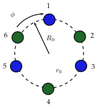

<!-- foo 
Highlighting
bold
strong
orange <b style="color:#d95f02"> text </b>
green  <b style="color:#1b9e77"> text </b>
purple <b style="color:#d24693"> text </b>
red    <b style="color:#FF0000"> text </b>
blue   <b style="color:#0000FF"> text </b>

Definición de onda 

font-weight:bold;
-->

Estabilidad y dinámica de modos ópticos en estructuras no lineales, helicoidales y PT-simétricas 
=================================================
title: Fibras opticas retorcidas
author: Dr. Claudia Castro Castro
date: 2 de Diciembre del 2020
autosize: true
incremental: true
width: 1920
height: 1080
font-family: 'Lato'

Seminario “Dr. Alberto Rubio” Facultad de Ciencias UABC 

   Copyright Disclaimer: material is for educational purposes only under fair use.

Índice
==========================================================

<ul>
<li>
Introducción
    <ul>
      <li>Definición de onda</li>
      <li>Antecedentes</li>
      <li>Fibras ópticas</li>
      <li>Fenómenos ópticos lineales vs no lineales</li>   
      <li>Ecuaciones de Maxwell</li>
      <li>¿Qué significa PT-simétrico?</li>
      <li>¿Qué significa torcido?</li>
    </ul>
</li>
<li>Ecuación de Schrödinger </li>
<li>Dinamica y estabilidad</li>
<li>Conclusiones</li>
</ul>

Definición intuitiva de onda 
========================================================

<ul style="list-style-type:none;">
Cualquier señal reconocible que se transfiere de una parte del medio a otra con una velocidad de propagación reconocible
</ul>

 

<small>Whitham, G. B., "Linear and nonlinear waves", Ed. John Wiley & Sons, 1974</small>

Antecedentes
========================================================

1790s: "Telégrafo óptico" inventado por Claude Chappe 

<small>Courtesía de Wikipedia Commons </small>

<ul style="list-style-type:none;">
<li> 1840s: Daniel Collodon y Jacques Babinet demostraron que la luz podía guiarse a través de chorros de agua para exhibiciones de fuentes.
</li>
<li> 
Cuando los rayos de luz en el agua golpean el borde del chorro con un ángulo, la <strong>reflexión interna total</strong> los atrapa en el líquido.
</li>

<li> 
Refracción en la superficie depende de la diferencia en el <strong>índice de refracción</strong>; cuanto mayor es la diferencia, más refracción
</li>
</ul>

<small>Hecht, J. City of Light: The Story of Fiber Optics
Oxford University Press, 1999</small>

Reflexión interna total (TIR)
========================================================

<ul style="list-style-type:none;">
<li> 
Es un efecto secundario de la <i>refracción</i>, la curvatura de la luz que pasa de un material transparente a otro.
</li>
</ul>

<small>Courtesía de Hecht, J. City of Light: The Story of Fiber Optics, 1999</small>

<ul style="list-style-type:none;">
<li> <strong>Índice de refracción</strong>
$$n=\frac{\text{velocidad de la luz en el vacio}}{\text{velocidad en el material}}$$
</li>
<li> <strong>Ley de Snell</strong>
$$n_1 \sin{\theta_1} = n_2 \sin{\theta_2} $$
</li>
<li> Resposable por 
</li>
</ul>

<small>Courtesía de Wikimedia Commons</small>

Reflexión interna total (TIR)
========================================================

<ul style="list-style-type:none;">
<li> 
</li>
</ul>

<small>Courtesía de Hecht, J. City of Light: The Story of Fiber Optics, 1999</small>

<ul>
<li> La luz que golpea la superficie casi directamente se refracta en el aire
</li>

<li>Hay un <b>ángulo crítico</b> donde no puede emerger al aire, se mide a partir de una línea llamada <b>normal</b> que es perpendicular a la superficie.
</li>
<li>Si $\theta_1 > \sin^{-1}\left(\frac{n_2}{n_1}\right)$ $\Rightarrow \sin \theta_2 > 1 \;\;(!)$
</li>
<li>
La luz fuera del ángulo crítico se refleja de nuevo en el cristal.
</li>
<li>ángulo crítico
$\theta_c = \sin^{-1}\left(\frac{n_2}{n_1}\right)$ existe solo cuando $n_2 < n_1$, entonces
TIR ocurre solo dentro del medio con índice más alto
</li>
</ul>

<small>Courtesía de Keerthi, CC BY 4.0 via Wikimedia Commons</small>

Inicios de las fibras opticas
========================================================

<ul>
<li>Generaciones de artesanos, inventores, ingenieros y científicos
desarrollaron la tecnología para hacer vidrio
</li>
  <ul>
  <li> Es <b>maleable</b>cuando está caliente, así como la <b>transparencia</b> del sólido, lo que lo ha convertido en un material atractivo.
  </li>
  <li> El ingrediente más importante del vidrio común es el dióxido de silicio, un mineral duradero conocido como <strong>Sílice/Silica</strong>.
  </li>
  </ul>
<li> 1930s: Heinrich Lamm (medico) primera persona conocida que ha demostrado la transmisión de imágenes a través de un arreglo de fibras ópticas
</li> 
  <ul>
  <li> Sin embargo, las fibras descubiertas transmitían imágenes de manera deficiente.
  </li>
  </ul>
<li>1950s: Van Heel y O'Brien recubren una fibra descubierta con un <b>material de índice menor</b> mantendría la TIR mientras protege la superficie óptica
</li>
<ul>
<li>Fibras revestidas de vidrio tenían una atenuación de aproximadamente un <b>decibel por metro (dB/m)</b>, lo que está bien para imágenes médicas, pero demasiado alto para comunicaciones.
</li>
</ul>
</ul>

<small>Hecht, J. City of Light: The Story of Fiber Optics
Oxford University Press, 1999</small>

Características de las fibras ópticas
========================================================

<small>Agrawal, Nonlinear fiber optics, Academic Press, 2013</small>

<ul style="list-style-type:none;">
<li> 
</li>
</ul>

Características de las fibras ópticas
========================================================

<ul style="list-style-type:none;">
<li> 
</li>
</ul>

<small>Courtesía de ..</small>

<small>Pertsch et al. Nonlinearity and
disorder in fiber arrays. Physical
Review letters, 2004</small>

<small>Joannopoulos et al. Photonic crystals: molding the flow of light. Princeton University Press, 2011.</small>

Ecuaciones de Maxwell
========================================================

La luz es una onda electro-magnética que consiste de un campo eléctrico  y un campo magnético oscilando a una taza muy alta ($10^{14}$ Hz) viajando en el espacio con una dirección perpendicular a ambos campos vectoriales

<ul style="list-style-type:none;">
<li>
</li>
<li>
$$\begin{align}
\nabla\times\mathbf{E}=&-\frac{\partial\mathbf{B}}{\partial t}\\
\nabla\times\mathbf{H}=&\mathbf{J}+\frac{\partial\mathbf{D}}{\partial t}\\
\nabla\cdot\mathbf{D}=&\rho_{v}\\
\nabla\cdot\mathbf{B}=&0
\end{align}$$
</li>
</li>
</ul>

<ul style="list-style-type:none;">
<li> 
 $\mathbf{E}$ campo eléctrico [$V/m$]
 $\mathbf{B}$ densidad de flujo magnético [$T$]
 $\mathbf{H}$ campo magnético [$A/m$]
 $\mathbf{D}$ densidad de flujo eléctrico [$C/m^2$]
 $\mathbf{J}$ densidad de corriente eléctrica  [$A/m^2$]
</li>
</ul>

<ul style="list-style-type:none;">
<li> $\mathbf{D}=\varepsilon \mathbf{E}$
 $\mathbf{B}=\mu \mathbf{H}$
 $\mathbf{J}=\sigma \mathbf{E}$
</li>
</ul>

## Ecuación de onda

<ul style="list-style-type:none;">
<li>El campo vectorial eléctrico satisface la ecuación de onda
$$\nabla^2 \mathbf{E}(\mathbf{r},t)-\frac{1}{c^2}\frac{\partial^2 \mathbf{E}(\mathbf{r},t)
}{\partial t^2}=0$$
</li>
<li>Esta ecuación es invariante  w. r. t tiempo $t\rightarrow -t$
</li>
</ul>

<small>Wartak, Computational photonics, Cambridge Univeristy Press, 2013</small>

Óptica lineal vs no lineal
========================================================

<ul style="list-style-type:none;">
<li><b style="color:#1b9e77"> Lineal </b>: las ondas electromagnéticas inducen una separación de las cargas en el material, es decir, una <i>polarización</i> $P_L$, la cual es <b style="color:#1b9e77">directamente proporcional</b> al campo eléctrico
$$P = \varepsilon_0 \chi^{(1)} E$$
donde   $\varepsilon_0$ es la <i>permitividad del vacío</i> y
$\chi^{(1)}$ es la constante de <i>susceptibilidad</i>.
</li>
</ul>

<ul>
<li> Interacción de la luz con la materia <b style="color:#1b9e77">no modifica</b> las propiedades de onda
</li>
<li>Ejemplos de fenómenos ópticos lineales:
</li>
</ul>

<small>
Reflexión
</small>

<small>
Refracción
</small>

<small>
Photocromia
</small>

<ul style="list-style-type:none">
<li>$\diamond$ Linealidad es una suposición que solo es válida para <b style="color:#1b9e77">bajas intensidades</b>
</li>
<li> 
</li>
<li>$\diamond$ Casi todos los materiales tienen algunos efectos no lineales si la fuente de luz solo es lo suficientemente potente  <b style="color:#d95f02">altas intensidades</b>
</li>
</ul>

   <small>Source</small>

Óptica no lineal
========================================================

<ul style="list-style-type:none;">
<li><b style="color:#d95f02">No lineal</b>: describe el comportamiento de la luz en medios  en   cual   el   componente   dieléctrico   de la <i>polarización</i> responde a la forma no lineal del campo eléctrico de la luz $E$
$$P=\varepsilon_0  \chi^{(1)}E + \varepsilon_0 \chi^{(2)}E^2 +  \varepsilon_0 \chi^{(3)}E^3+\dots$$
</li>
</ul>

<ul>
<li> 2nd order susceptibility $$\chi^{(2)} \approx 1.94\times10^{-12}\;m/V$$
</li>
<li> 3rd order susceptibility$$\chi^{(3)} \approx 3.78\times10^{-24}\;m^2/V^2$$
</li>
<li> Para fibras de silica $SiO_2$ el effecto de segundo orden es despreciable
</li>
<li> $\chi^{(3)}$ está asociada al <strong>effecto Kerr</strong>
</li>
<li>Polarizacion total: lineal + no lineal 
$$P(\omega) = \varepsilon_0 \chi^{(1)}E(\omega)+3\varepsilon_0\chi^{(3)}|E(\omega)|^2E(\omega)  $$
</li>
<li>Effective susceptibility
$$\chi_{eff} = \chi^{(1)}+3\chi^{(3)}|E(\omega)|^2 $$
</li>
<li>Está ligada al índice de refracción 
$$\bar{n} = 1+\chi^{(3)}=\bar{n}_0 +\bar{n}_2\;I$$
</li>
</ul>

Óptica no lineal: effecto Kerr 
========================================================
 

<ul style="list-style-type:none;">
<li> Descubierta por John Kerr en 1875
</li>
<li> Describe situaciones donde el indice de refraccion depende de el campo electrico como 
$$\bar{n}(\omega, |E|^2)=\bar{n}_0(\omega) + \bar{n}_2(\omega)|E|^2$$
</li>
<li>Para silica es $1.3\times10^{-22}\; m^2/V^2$
</li>
</ul>

Derivación de Schroedinger
========================================================

<ul style="list-style-type:none;">
<li>En medio Kerr el índice de refracción depende de la intensidad del campo eléctrico $I(t)$
$$\bar{n}(t)=\bar{n}_0 + \bar{n}_2 I(t), \;\;\;I(t)=2\bar{n}_0\varepsilon_0 c |A(z,t)|^2$$
</li>
<li> y 
$$E(z,t)=A(z,t)e^{i(\omega_0 t-\beta _0 z)}$$
</li>
<li>Aplicando transformada de Fourier del campo optico
$$E(z,t)=\int_{-\infty}^{\infty} \tilde{E}(z,\omega)e^{i(\omega t - \beta z)} \;d\omega$$
</li>
<li>Considerar la expansion de Taylor de la constante de propagacion
$$\beta(\omega) = \beta_0 + \beta _1 (\omega - \omega_0 )+\frac{1}{2}\beta_2 (\omega - \omega_0)^2 + \Delta \beta_{NL}$$
</li>
<li>Sustituir
$$\begin{align}
E(z,t)=&e^{-i\beta_0 z}\int_{-\infty}^{\infty} \tilde{E}(z,\omega)e^{i\omega t - i\beta_1 z \Delta \omega - i\frac{1}{2}\beta_2 z \Delta \omega^2-iz\Delta\beta_{NL} } \;d(\Delta\omega)\\
=&e^{i(\omega_0t-\beta_0 z)}\int_{-\infty}^{\infty} \tilde{E}(z,\omega_0 +\Delta \omega)e^{it\Delta\omega-i\beta_1 z \Delta \omega - i\frac{1}{2}\beta_2 z \Delta \omega^2-iz\Delta\beta_{NL}} \;d(\Delta\omega)\\
\equiv&e^{i(\omega_0 t-\beta _0 z)} A(z,t)
\end{align}$$
</li>
</ul>

<small>Wartak, Computational photonics, Cambridge Univeristy Press, 2013</small>

Parity-Time table
========================================================

<ul style="list-style-type:none;">
<li> 
<li>
</li>
</ul>

Fibras torcidas
========================================================

<ul style="list-style-type:none;">
<li> 
<li>
</li>
</ul>

<small>
Fibra optica torcida
</small>

<small>
Fibra óptica torcida
</small>

Gauss's Magnetism Law 
========================================================

<ul style="list-style-type:none;">
<li><strong>Divergence Theorem</strong>
$$\iint\limits_S \mathbf{\vec{B}}\cdot d\mathbf{\vec{S}} = \iiint\limits_E (\nabla \cdot \mathbf{\vec{B}})\;dV $$
</li>
<li>then
$$\iiint\limits_E (\nabla \cdot \mathbf{\vec{B}})\;dV=0$$
</li>
<li>must be true when

 
$$\nabla \cdot \mathbf{\vec{B}} =0$$
<b style="color:#d95f02">divergence of magnetic field is zero</b>

</li>
</ul>

