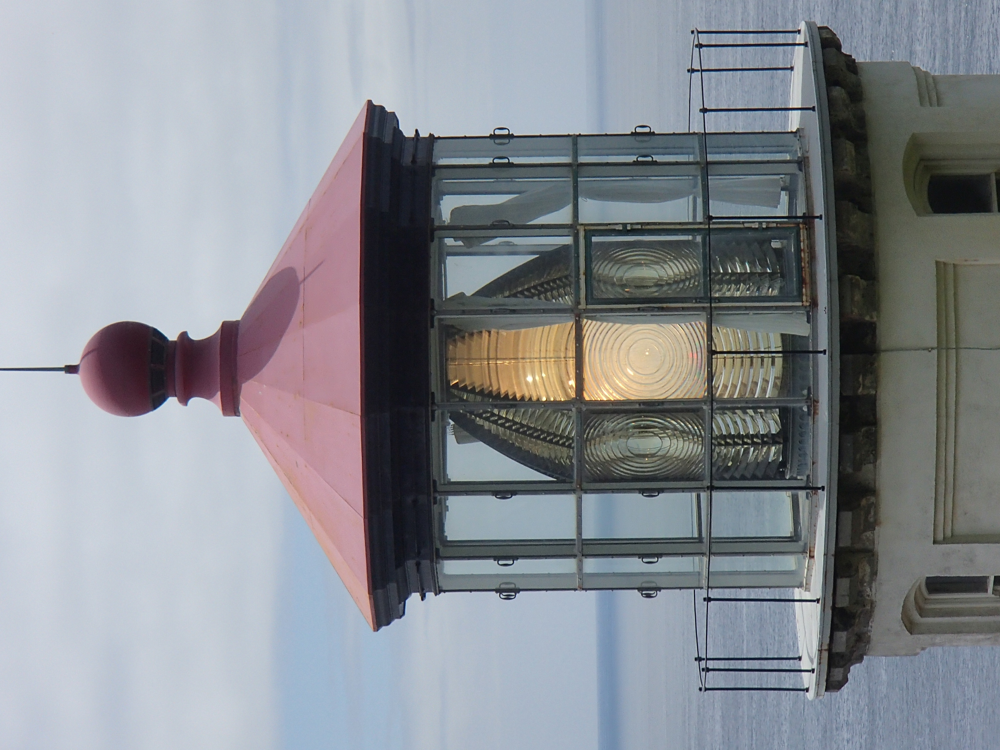
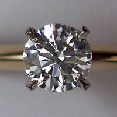

<!-- foo 
Highlighting
bold
strong
orange <b style="color:#d95f02"> text </b>
green  <b style="color:#1b9e77"> text </b>
purple <b style="color:#d24693"> text </b>
red    <b style="color:#FF0000"> text </b>
blue   <b style="color:#0000FF"> text </b>

Definición de onda 

font-weight:bold;
-->

Estabilidad y dinámica de modos ópticos en estructuras no lineales, helicoidales y PT-simétricas 
=================================================
title: Fibras opticas retorcidas
author: Dr. Claudia Castro Castro
date: 2 de Diciembre del 2020
autosize: true
incremental: true
width: 1920
height: 1080
font-family: 'Lato'

Seminario “Dr. Alberto Rubio” Facultad de Ciencias UABC 

   Copyright Disclaimer: material is for educational purposes only under fair use.

Índice
==========================================================

<ul>
<li>
Introducción
    <ul>
      <li>Definición de onda</li>
      <li>Antecedentes</li>
      <li>Características de fibras ópticas</li>
    </ul>
<li>Fenómenos ópticos lineales vs no lineales</li>   
<li>Ecuaciones de Maxwell</li>
<li>Ecuacion discreta no lineal de Schrödinger </li>
<li>PT-simetría</li>
<li>Fibras helicoidales</li>
<li>Existencia y estabilidad</li>
<li>Conclusiones</li>
</ul>

Definición intuitiva de onda 
========================================================

<ul style="list-style-type:none;">
Cualquier señal reconocible que se transfiere de una parte del medio a otra con una velocidad de propagación reconocible
</ul>

 

<small>Whitham, G. B., "Linear and nonlinear waves", Ed. John Wiley & Sons, 1974</small>

Antecedentes
========================================================

1790s: "Telégrafo óptico" inventado por Claude Chappe 

<small>Courtesía de Wikipedia Commons </small>

<ul style="list-style-type:none;">
<li> 1840s: Daniel Collodon y Jacques Babinet demostraron que la luz podía guiarse a través de chorros de agua para exhibiciones de fuentes.
</li>
<li> 
Cuando los rayos de luz en el agua golpean el borde del chorro con un ángulo, la <strong>reflexión interna total</strong> los atrapa en el líquido.
</li>

<li> 
Refracción en la superficie depende de la diferencia en el <strong>índice de refracción</strong>; cuanto mayor es la diferencia, más refracción
</li>
</ul>

<small>Hecht, J. City of Light: The Story of Fiber Optics
Oxford University Press, 1999</small>

Reflexión interna total (TIR)
========================================================

<ul style="list-style-type:none;">
<li> 
Es un efecto secundario de la <i>refracción</i>, la curvatura de la luz que pasa de un material transparente a otro.
</li>
</ul>

<small>Courtesía de Hecht, J. City of Light: The Story of Fiber Optics, 1999</small>

<ul style="list-style-type:none;">
<li> <strong>Índice de refracción</strong>
$$n=\frac{\text{velocidad de la luz en el vacio}}{\text{velocidad en el material}}$$
</li>
<li> <strong>Ley de Snell</strong>
$$n_1 \sin{\theta_1} = n_2 \sin{\theta_2} $$
</li>
<li> Resposable por 
</li>
</ul>

<small>Courtesía de Wikimedia Commons</small>

Reflexión interna total (TIR)
========================================================

<ul style="list-style-type:none;">
<li> 
</li>
</ul>

<small>Courtesía de Hecht, J. City of Light: The Story of Fiber Optics, 1999</small>

<ul>
<li> La luz que golpea la superficie casi directamente se refracta en el aire
</li>

<li>Hay un <b>ángulo crítico</b> donde no puede emerger al aire, se mide a partir de una línea llamada <b>normal</b> que es perpendicular a la superficie.
</li>
<li>Si $\theta_1 > \sin^{-1}\left(\frac{n_2}{n_1}\right)$ $\Rightarrow \sin \theta_2 > 1 \;\;(!)$
</li>
<li>
La luz fuera del ángulo crítico se refleja de nuevo en el cristal.
</li>
<li>ángulo crítico
$\theta_c = \sin^{-1}\left(\frac{n_2}{n_1}\right)$ existe solo cuando $n_2 < n_1$, entonces
TIR ocurre solo dentro del <b>medio con índice más alto</b>
</li>
</ul>

<small>Courtesía de Keerthi, CC BY 4.0 via Wikimedia Commons</small>

Inicios de las fibras ópticas
========================================================

<ul>
<li>Generaciones de artesanos, inventores, ingenieros y científicos
desarrollaron la tecnología para hacer vidrio
</li>
  <ul>
  <li> Es <b>maleable</b> cuando está caliente, así como la <b>transparencia</b> del sólido, lo que lo ha convertido en un material atractivo.
  </li>
  <li> El ingrediente más importante del vidrio común es el dióxido de silicio, un mineral duradero conocido como <strong>Sílice/Silica</strong>.
  </li>
  </ul>
<li> 1930s: Heinrich Lamm (médico) primera persona conocida que ha demostrado la transmisión de imágenes a través de un arreglo de fibras ópticas
</li> 
  <ul>
  <li> Sin embargo, las fibras descubiertas transmitían imágenes de manera deficiente.
  </li>
  </ul>
<li>1950s: Van Heel y O'Brien recubren una fibra descubierta con un <b>material de índice menor</b> mantendría la TIR mientras protege la superficie óptica
</li>
<ul>
<li>Fibras revestidas de vidrio tenían una atenuación de aproximadamente un <b>decibel por metro (dB/m)</b>, lo que está bien para imágenes médicas, pero demasiado alto para comunicaciones.
</li>
</ul>
</ul>

<small>Hecht, J. City of Light: The Story of Fiber Optics
Oxford University Press, 1999</small>

Fibras ópticas
========================================================

<small>Courtesía de depositphotos.com</small>

<small>Pertsch et al. Nonlinearity and
disorder in fiber arrays. Physical
Review letters, 2004</small>

<small>Joannopoulos et al. Photonic crystals: molding the flow of light. Princeton University Press, 2011.</small>

Características de las fibras ópticas
========================================================

<small>Agrawal G., Nonlinear fiber optics, Academic Press, 2013</small>

<ul>
<li> En su forma más simple, una fibra optica consiste de un nucle de cristal rodeado de una revestimiento con índice de refracción $n_c$
<li> Índice de refracción del revestimiento es $n_1$ 
con $n_c < n_1$ 
</li>
<li>El material de elección para las fibras ópticas de <b>baja pérdida</b> es el cristal de <strong>sílice</strong> puro sintetizado mediante la fusión de moléculas de $SiO_2$.
</li>
<li>La diferencia del índice de refracción entre el núcleo y el
el revestimiento se realiza mediante el uso selectivo de dopantes durante el proceso de fabricación. Los dopantes como $GeO_2$ y $P_2 O_5$ aumentan el índice de refracción de del sílice y son adecuados para el núcleo
</li>
<li>Poder transmitido
$$P_T = P_0 exp(-\alpha L)$$
$P_0$ poder inicial, $L$ longitud, $\alpha$ constante de atenuación
</li>
</ul>

Dispersión
========================================================

<small>Cortesia de Pixabay </small>

 

<ul>
<li> Como cuando una piedra que cae en un estanque inmóvil produce ondas en la superficie del agua, eventualmente desaparecen y se desvanecen
</li>
<li>
Un rayo de luz puede extenderse cuando viaja a través de diferentes medios.
</li>
<li> La dispersión temporal y la difracción espacial se deben a la dependencia del índice de refracción de la frecuencia y la longitud de onda
</li>
<li>Ambos causan un ensanchamiento espacial y temporal de la luz.
</li>
</ul>

<small>Yang J., "Nonlinear waves and nonintegrable systems", Ed. SIAM, 2010</small>

Ecuaciones de Maxwell
========================================================

La luz es una <b>onda electro-magnética</b> que consiste de un campo eléctrico  y un campo magnético oscilando a una tasa muy alta ($10^{14}$ Hz) viajando en el espacio con una dirección perpendicular a ambos campos vectoriales

<ul style="list-style-type:none;">
<li>
$$\begin{align}
\nabla\times\mathbf{E}=&-\frac{\partial\mathbf{B}}{\partial t}\\
\nabla\times\mathbf{H}=&\mathbf{J}+\frac{\partial\mathbf{D}}{\partial t}\\
\nabla\cdot\mathbf{D}=&\rho_{v}\\
\nabla\cdot\mathbf{B}=&0
\end{align}$$
</li>
</ul>

<ul style="list-style-type:none;">
<li> 
 $\mathbf{E}$ campo eléctrico [$V/m$]
 $\mathbf{B}$ densidad de flujo magnético [$T$]
 $\mathbf{H}$ campo magnético [$A/m$]
 $\mathbf{D}$ densidad de flujo eléctrico [$C/m^2$]
 $\mathbf{J}$ densidad de corriente eléctrica  [$A/m^2$]
</li>
</ul>

<ul style="list-style-type:none;">
<li>  $\mathbf{D}=\varepsilon \mathbf{E}$
 $\mathbf{B}=\mu \mathbf{H}$
 $\mathbf{J}=\sigma \mathbf{E}$
  $\varepsilon= \varepsilon_0 \varepsilon_r$ dielectric permittivity
 $\mu= \mu_0 \mu_r$ permeability
 $\sigma$ electric conductivity
</li>
</ul>

<ul style="list-style-type:none;">
</ul>

<ul>
<h2>Ecuación de onda</h2>
<li>El campo vectorial eléctrico satisface la ecuación de onda
$$\nabla^2 \mathbf{E}(\mathbf{r},t)-\frac{1}{c^2}\frac{\partial^2 \mathbf{E}(\mathbf{r},t)
}{\partial t^2}=0$$
</li>
<li><strong>T-simetría</strong>: ecuación es <strong>invariante</strong>  w. r. t. tiempo $t\rightarrow -t$
</li>
</ul>

<small>Wartak, Computational photonics, Cambridge Univeristy Press, 2013</small>

Óptica lineal vs no lineal
========================================================

<ul style="list-style-type:none;">
<li><b style="color:#1b9e77"> Lineal </b>: las ondas electromagnéticas inducen una separación de las cargas en el material, es decir, una <i>polarización</i> $P_L$, la cual es <b style="color:#1b9e77">directamente proporcional</b> al campo eléctrico
$$P = \varepsilon_0 \chi^{(1)} E$$
donde   $\varepsilon_0$ es la <i>permitividad del vacío</i> y
$\chi^{(1)}$ es la constante de <i>susceptibilidad</i>.
</li>
</ul>

<ul>
<li> Interacción de la luz con la materia <b style="color:#1b9e77">no modifica</b> las propiedades de onda
</li>
<li>Ejemplos de fenómenos ópticos lineales:
</li>
</ul>

<small>
Reflexión
</small>

<small>
Refracción
</small>

<small>
Photocromia
</small>

<ul style="list-style-type:none">
<li>$\diamond$ Linealidad es una suposición que solo es válida para <b style="color:#1b9e77">bajas intensidades</b>
</li>
<li> 
</li>
<li>$\diamond$ Casi todos los materiales tienen algunos efectos no lineales si la fuente de luz solo es lo suficientemente potente  <b style="color:#d95f02">altas intensidades</b>
</li>
</ul>

   <small>Agrawal G., Nonlinear fiber optics, Academic Press, 2013 </small>

Óptica no lineal
========================================================

<ul style="list-style-type:none;">
<li><b style="color:#d95f02">No lineal</b>: describe el comportamiento de la luz en medios  en   cual   el   componente   dieléctrico   de la <i>polarización</i> responde a la forma no lineal del campo eléctrico de la luz $E$
$$P=\varepsilon_0  \chi^{(1)}E + \varepsilon_0 \chi^{(2)}E^2 +  \varepsilon_0 \chi^{(3)}E^3+\dots$$
</li>
</ul>

<ul>
<li> 2nd order susceptibility $$\chi^{(2)} \approx 1.94\times10^{-12}\;m/V$$
</li>
<li> 3rd order susceptibility$$\chi^{(3)} \approx 3.78\times10^{-24}\;m^2/V^2$$
</li>
<li> Para fibras de <strong>sílice</strong> $SiO_2$ el effecto de segundo orden es despreciable
</li>
<li> $\chi^{(3)}$ está asociada al <strong>effecto Kerr</strong>
</li>
<li>Polarizacion total: lineal + no lineal 
$$P(\omega) = \varepsilon_0 \chi^{(1)}E(\omega)+3\varepsilon_0\chi^{(3)}|E(\omega)|^2E(\omega)  $$
</li>
<li>Effective susceptibility
$$\chi_{eff} = \chi^{(1)}+3\chi^{(3)}|E(\omega)|^2 $$
</li>
<li>Está ligada al índice de refracción 
$$\bar{n} = 1+\chi^{(3)}=\bar{n}_0 +\bar{n}_2\;I$$
</li>
</ul>

Óptica no lineal: effecto Kerr 
========================================================
 

<ul style="list-style-type:none;">
<li> Descubierta por John Kerr en 1875
</li>
<li> Describe situaciones donde el índice de refracción depende de el campo eléctrico como 
$$\bar{n}(\omega, |E|^2)=\bar{n}_0(\omega) + \bar{n}_2(\omega)|E|^2$$
</li>
<li>Para sílice es $1.3\times10^{-22}\; m^2/V^2$
</li>
</ul>

Derivación de la ecuación de Schrödinger
========================================================

<ul style="list-style-type:none;">
<li>En medio Kerr el índice de refracción depende de la intensidad del campo eléctrico $I(t)$
$$\bar{n}(t)=\bar{n}_0 + \bar{n}_2 I(t), \;\;\;I(t)=2\bar{n}_0\varepsilon_0 c |A(z,t)|^2$$
</li>
<li> y 
$$E(z,t)=A(z,t)e^{i(\omega_0 t-\beta _0 z)}$$
</li>
<li>Aplicando transformada de Fourier del campo óptico
$$E(z,t)=\int_{-\infty}^{\infty} \tilde{E}(z,\omega)e^{i(\omega t - \beta z)} \;d\omega$$
</li>
<li>Considerar la expansion de Taylor de la constante de propagación
$$\beta(\omega) = \beta_0 + \beta _1 (\omega - \omega_0 )+\frac{1}{2}\beta_2 (\omega - \omega_0)^2 + \Delta \beta_{NL}$$
</li>
<li>Sustituir
$$\begin{align}
E(z,t)=&e^{-i\beta_0 z}\int_{-\infty}^{\infty} \tilde{E}(z,\omega)e^{i\omega t - i\beta_1 z \Delta \omega - i\frac{1}{2}\beta_2 z \Delta \omega^2-iz\Delta\beta_{NL} } \;d(\Delta\omega)\\
=&e^{i(\omega_0t-\beta_0 z)}\int_{-\infty}^{\infty} \tilde{E}(z,\omega_0 +\Delta \omega)e^{it\Delta\omega-i\beta_1 z \Delta \omega - i\frac{1}{2}\beta_2 z \Delta \omega^2-iz\Delta\beta_{NL}} \;d(\Delta\omega)\\
\equiv&e^{i(\omega_0 t-\beta _0 z)} A(z,t)
\end{align}$$
</li>
</ul>

<small>Wartak, "Computational photonics", Cambridge Univeristy Press, 2013</small>

Derivación de la ecuación de Schrödinger
========================================================

<ul style="list-style-type:none;">
<li> Hemos definido 
$$A(z,t) = \int_{-\infty}^{\infty} \tilde{E}(z,\omega_0 +\Delta \omega)e^{it\Delta\omega-i\beta_1 z \Delta \omega - i\frac{1}{2}\beta_2 z \Delta \omega^2-iz\Delta\beta_{NL}} \;d(\Delta\omega)
=\int_{-\infty}^{\infty} \tilde{E}(z,\omega_0 +\Delta \omega)e^{ig(z,t)} \;d(\Delta\omega)$$
</li>
<li> Derivar
$$\begin{align}
\frac{ \partial A(z,t)}{\partial t}  =&\int_{-\infty}^{\infty} \tilde{E}(z,\omega_0 +\Delta \omega)i\Delta \omega e^{ig(z,t)} \;d(\Delta\omega) \\
\frac{ \partial^2 A(z,t)}{\partial t^2}  =&\int_{-\infty}^{\infty} \tilde{E}(z,\omega_0 +\Delta \omega)(i\Delta \omega)^2 e^{ig(z,t)} \;d(\Delta\omega) \\
\frac{ \partial A(z,t)}{\partial z}  =&\int_{-\infty}^{\infty} \tilde{E}(z,\omega_0 +\Delta \omega)(-i\beta_1  \Delta \omega - i\frac{1}{2}\beta_2 \Delta \omega^2-i\Delta\beta_{NL}) e^{ig(z,t)} \;d(\Delta\omega) 
\end{align}$$
</li>
<li>Combinar
$$\frac{ \partial A(z,t)}{\partial z} +  \beta_1 \frac{ \partial A(z,t)}{\partial t} -i\frac{1}{2}\beta_2 \frac{ \partial^2 A(z,t)}{\partial t^2} =  \int_{-\infty}^{\infty} \tilde{E}(z,\omega_0 +\Delta \omega) \left[  ... \right]e^{ig(z,t)} \;d(\Delta\omega)$$
</li>
<li> La expresion en $[...]$ es $-i\bar{n}_2k_0 I$
</li>
<li>Entonces
$$\frac{ \partial A(z,t)}{\partial z} +  \beta_1 \frac{ \partial A(z,t)}{\partial t} -i\frac{1}{2}\beta_2 \frac{ \partial^2 A(z,t)}{\partial t^2} =  -i\bar{n}_2k_0I \int_{-\infty}^{\infty} \tilde{E}(z,\omega_0 +\Delta \omega) e^{ig(z,t)} \;d(\Delta\omega)$$
</li>
</ul>

<small>Wartak, "Computational photonics", Cambridge Univeristy Press, 2013</small>

Derivación de la ecuación de Schrödinger
========================================================

<ul style="list-style-type:none;">
<li>
</li>
<li>Entonces
$$\frac{ \partial A(z,t)}{\partial z} +  \beta_1 \frac{ \partial A(z,t)}{\partial t} -i\frac{1}{2}\beta_2 \frac{ \partial^2 A(z,t)}{\partial t^2} =  -i\bar{n}_2k_0 I \int_{-\infty}^{\infty} \tilde{E}(z,\omega_0 +\Delta \omega) e^{ig(z,t)} \;d(\Delta\omega)$$
</li>
<li>
$$``\qquad" \qquad =  -i\bar{n}_2k_0 I A(z,t)$$
</li>
<li> Por lo tanto 
</li>
</ul>

<ul style="list-style-type:none;">
<li>
$$\frac{ \partial A(z,t)}{\partial z} +  \beta_1 \frac{ \partial A(z,t)}{\partial t} -i\frac{1}{2}\beta_2 \frac{ \partial^2 A(z,t)}{\partial t^2} = i\gamma |A(z,t)|^2A(z,t)-\frac{\alpha}{2}A(z,t)$$
</li>
</ul>

 

<small>Wartak, Computational photonics, Cambridge Univeristy Press, 2013</small>

Ecuación discreta no lineal de Schrödinger (DNLS)
========================================================

<ul style="list-style-type:none;">
<li> 
Considere la dinámica de propagación en un arreglo <b>discreto</b> de fibras ópticas descrita por la ecuación discreta de Schrödinger no lineal (DNLS)
$$\begin{equation}\label{eq:DNLSE}
i \frac{dc_n}{dz} =  \epsilon_n c_n  - k(c_{n+1}+c_{n-1}) + \sigma|c_n|^2c_n,
\end{equation}$$
</li>
<li>$c_n$: amplitudes complejas,  en el sitio $n$, que dependen de la dirección de la variable de propagación $z\in\mathbb{R}$
 $k$: fuerza uniforme de acoplamiento con el vecino más cercano
 $\epsilon_n$: perfil de índice de refracción in-situ
 $\sigma$: fuerza de no linealidad
</li>
<li>$\diamond$ El hamiltoniano que da lugar a las ecuaciones de movimiento viene dado por la ecuación
$$\begin{equation}\label{eq:hamiltonian}
H_D = \sum_n \epsilon_n|c_n|^2 + \frac{\sigma}{2}|c_n|^4 - k\left(c_{n+1}c_n^*+c^*_{n+1}c_n  \right).
\end{equation}$$
</li>
<li>Configuración ideal de guías de ondas ópticas idénticas, donde $\epsilon_n$ es una constante fija $\epsilon$.
</li>
</ul>

<small>
Representación esquemática de un arreglo de guías de ondas ópticas planar. $r_n$ es el radio de cada núcleo en particular
</small>

Parity-Time (PT) simetría
========================================================

<ul style="list-style-type:none;">
<li>
<table style="font-size: 40px; width: 100%; text-align: center; " class="minimalistBlack">
<tr>
  <th>Quantum Mechanics</th>
  <th>Optics</th>
</tr>
<tr>
  <td>Schrödinger equation</td>
  <td>Paraxial equation</td>
</tr>
<tr>
  <td>$i\hslash\frac{\partial\Psi}{dt}+\frac{h^{2}}{2m}\frac{\partial^{2}\Psi}{\partial x^{2}}-V\left(x\right)\Psi=0$</td>
  <td>$i\lambda\frac{\partial E}{\partial z}+\frac{\lambda^{2}}{2}\frac{\partial^{2}E}{\partial x^{2}}+n\left(x\right)E=0$</td>
</tr>
<tr>
  <td>time </td> <td>propagation distance</td>
</tr>
<tr>
  <td>$t$</td>  <td>$z$</td>
</tr>
<tr>
  <td>Plank's constant </td> <td>Wavelength</td>
</tr>
<tr>
  <td>$\hslash$</td>  <td>$\lambda=\frac{1}{k}$</td>
</tr>
<tr>
  <td>Probability amplitude </td> <td>Electric field envelope</td>
</tr>
<tr>
  <td>$\Psi\left(x,t\right)$</td>  <td>$E\left(x,z\right)$</td>
</tr>
<tr>
  <td>Complex potential</td> <td>Complex refraction</td>
</tr>
<tr>
  <td>$V\left(x\right)=V_{R}\left(x\right)+iV_{I}\left(x\right)$</td>  <td>$n\left(x\right)=n_{R}\left(x\right)+in_{I}\left(x\right)$</td>
</tr>
</table>
</li>
</ul>

Parity-Time (PT) simetría
========================================================

<ul style="list-style-type:none">
<li>Bender consideró si un sistema hamiltoniano mecánico cuántico con un potencial complejo puede tener un espectro real. 
</li>
<li>

P: $\hat{x}\rightarrow -\hat{x}\;$ y $\;\hat{p}\rightarrow -\hat{p}$ 
T: $\hat{x}\rightarrow \hat{x}\;$, $\;\hat{p}\rightarrow -\hat{p}\;$, y  $\;i\rightarrow -i$ 

 $\hat{p}$: momentum operator.
 $\hat{x}$: space operator.
</li>
<li>

 <strong> Condición de PT-simetría</strong>
$$V(x) = V^*(-x)\qquad n(x)= n^*(-x)$$ 

Esto se traduce en el potencial complejo cuya parte real es una función par mientras que la parte imaginaria es impar.
</li>
<li> $\circ$ Hamiltoniano PT-simétrico
<ul>
<li> Puede tener un eigen-espectro real
</li>
<li> Eigen-estados PT-simétricos puede que occurran para cierto régimen paramétrico
</ul>
</li>
</ul>

<small>Bender, "Making sense of non-Hermitian Hamiltonians", Reports on Progress in Physics 2007</small>

Parity-Time (PT) simetría
========================================================

Sistemas ópticos acoplados convencionales y PT-simétricos. 

<small>Rüter et al., Nature Physics, 2010
</small>

Propagación del haz en dos guías de ondas PT-simétricas no lineales.

<small> Ramezani et al. PR A 2010
</small>

Dispersor recubierto con una metasuperficie ultrafina con pérdida y ganancia equilibradas. 

<small>Sounas et al., Phys. Rev. Applied 2015
</small>

Fibras  multi-núcleo no lineal PT-simétricas
========================================================

<ul style="list-style-type:none;">
<li> Considere la dinámica de propagación del haz en una fibra discreta de múltiples núcleos de $N$ sitios dispuestos igualmente espaciados en un anillo de radio $R_0$ donde cada núcleo tiene un radio $r_0$, descrito por las ecuaciones de modos acoplados
Dinámica de propagación en una matriz discreta de fibras ópticas descrita por la ecuación discreta de Schrodinger no lineal (DNLS)
$$i\frac{{dc_{n}}}{dz}=k\left(c_{n+1}+c_{n-1}\right)+i\gamma_{n}c_{n}+\sigma|c_{n}|^{2}c_{n}$$
</li>
<li>$c_n$: representa amplitudes complejas,  en el sitio $n$, que dependen de la dirección de la variable de propagación $z\in\mathbb{R}$
 $k$: fuerza uniforme del acoplamiento con el vecino más cercano
 $\gamma_n$:tasa de <b style="color:blue">ganancia</b> óptica (${\color{blue} {\gamma_n>0}}$) o <b style="color:gray">pérdida</b> (${\color{gray} {\gamma_n<0}}$)

</li>
</ul>

<small>Esquema de fibra óptica multi-core PT-simétrica
</small>

Fibras  multi-núcleo no lineal helicoidal PT-simétricas
========================================================

<ul style="list-style-type:none;">
<li> Considere la dinámica de propagación del haz en una fibra discreta de múltiples núcleos de $N$ sitios dispuestos igualmente espaciados en un anillo de radio $R_0$ donde cada núcleo tiene un radio $r_0$, descrito por las ecuaciones de modos acoplados
Dinámica de propagación en una matriz discreta de fibras ópticas descrita por la ecuación discreta de Schrodinger no lineal (DNLS)
$$i\frac{{dc_{n}}}{dz}=k\left({\color{orange} {e^{-i\phi}}}c_{n+1}+{\color{orange} {e^{i\phi}}}c_{n-1}\right)+i\gamma_{n}c_{n}+\sigma|c_{n}|^{2}c_{n}$$
</li>
<li>$c_n$: representa amplitudes complejas,  en el sitio $n$, que dependen de la dirección de la variable de propagación $z\in\mathbb{R}$
 $k$: fuerza uniforme del acoplamiento con el vecino más cercano

 $\gamma_n$: tasa de <b style="color:blue">ganancia</b> óptica (${\color{blue} {\gamma_n>0}}$) o <b style="color:gray">pérdida</b> (${\color{gray} {\gamma_n<0}}$)
  $\phi$: <b style="color:#d95f02">Peierls phase</b>
</li>
</ul>

<small>Esquema de fibra óptica helicoidal PT-simétrica
</small>

Ruptura de PT-simetría: caso lineal
========================================================

$$i\frac{{dc_{n}}}{dz}=k\left(^{-i\phi}c_{n+1}+^{i\phi}c_{n-1}\right)+i\gamma_{n}c_{n}$$
<ul>
<li>PT-simetría alternante $\gamma_n=(-1)^{n+1}\gamma$,  $\gamma=2.04$
<ul><li>Cambio de signo $\Leftrightarrow$ ganancia/perdida</li></ul>
</li>
<li>Condiciones de frontera periódicas $c_{n + N} = c_n$</li>
<li>Otros valores usados $\sigma=0$, $n_s=1.552$, $R_0=8\mu m$, $\lambda=980nm$, $r_0=0.91R_0$</li>
</ul>

Observe the PT-symmetry breaking induced by the twist of the fiber.

<small>Longhi S., PT phase control in circular multi-core fibers. Optics letters, 2016.
</small>

<ul style="list-style-type:none;">
<li>Cuando se tuerce por un ángulo de $\phi =\pi/6$ se volve inestable :(
</li>
</ul>

No lineal conservado (no PT)
========================================================
$$i\frac{{dc_{n}}}{dz}=k\left(e^{-i\phi}c_{n+1}+e^{i\phi}c_{n-1}\right)+{\color{gray} {i\gamma_{n}c_{n}}}+\sigma|c_{n}|^{2}c_{n}$$
con $\gamma_n =0$

<ul>
<li>Introduce la transformación $c_n = a_n(z)e^{i\varphi_ n}$, $\varphi_ {n+1} −\varphi_n= \phi$</li>
<li>Las ecuaciones para $a_n$ son la forma clásica uniforme, pero ahora la condición de frontera es modificada a  $a_{n+N} = a_n e^{ iN\varphi}$. 
</li>
<li>La transformación se refleja en el Hamiltoniano
$$H=\sum_{n=1}^N k \left( c_{n + 1} c_n^*e^{-i \phi} + c_n c^*_{n+1} e^{i \phi}\right)+\frac{\sigma}{2}|c_n|^4 = 
  \sum_{n=1}^N k \left( a_{n + 1} a_n^* + a_n a^*_{n+1} \right)+\frac{\sigma}{2}|a_n|^4.$$
</li>
<li>Poder total $$P = \sum_n^N |c_n|^2$$ 
</li>
</ul>

No lineal, helicoidal, pero conservado
========================================================

<ul>
<li>Este comportamiento sugiere que la característica topológica del giro y su efecto sobre la dinámica es bastante <b>robusto</b> a las contribuciones no lineales que afectan principalmente a las fases individuales
</li>
</ul>

<small>Evolution of field intensities for cores 1 (solid) and 4 (dashed) in the nonlinear, conservative, and defocusing case with $\gamma = 0$. Left and right panels correspond to non-twisted and twisted scenarios respectively.
</small>

No lineal, helicoidal, casi PT-simétrico
========================================================

<ul>
<li>Buscamos soluciones estacionarias de la forma
$$c_{n}=\begin{cases}
A_{n}e^{-i\lambda z}, & n=\text{impar}\\
B_{n}e^{-i\lambda z}, & n=\text{par}
\end{cases}$$
asumiendo $A_n=A$ y $B_n = B$
</li>
<li>Nos lleva a 
$$\begin{align}
-\lambda A	+	2k\cos{\phi}B+i\gamma A + \sigma|A|^2A=0, \label{eq:stationary_sol_reducida1}\\
-\lambda B	+	2k\cos{\phi}A-i\gamma B + \sigma|B|^2B=0. \label{eq:stationary_sol_reducida2}
\end{align}$$
</li>
<li>Por el momento $\gamma =0$</li>
<li>Notamos que podemos intercambiar $A$ con  $B$
$$A\left(-\lambda 	+	2k\cos{\phi}+ \sigma|A|^2\right)=0.
\label{eq:stationary_sol_reducida_A_order0}$$
</li>
<li>Desde donde podemos notar que existirá una solución no trivial si $$\lambda> 2k \cos \phi$$ cuando $\sigma$ es positivo.
</li>
</ul>

<small>Soluciones numéricas  $k = 1$, $\sigma = 1$, $\gamma = 0$, varios valores de $\phi$. El código de color es azul para $\pi/8$, naranja para $\pi/6$, amarillo para $\pi/5$ y violeta para $\pi/4$
</small>

No lineal, helicoidal, PT-simétrico
========================================================

<ul>
<li>
Considere un caso donde la fuerza de ganancia/pérdida es cercana a cero y que puede expandirse en términos de un parámetro pequeño  $\epsilon<<1$
</li>
<li>Nos gustaría continuar esta solución en un vecindad de $((A^{(0)}, B^{(0)})^T, \gamma^{(0)})$, aquí $A^{(0)}$ denota la solución asociada
al caso $\gamma = \gamma^{(0)} = 0$.
</li>
<li>
Introducimos expansiones en términos de $\epsilon$
$$\begin{array}{rl}
\gamma =& \gamma^{(0)} + \epsilon \gamma^{(1)} + \epsilon^2 \gamma^{(2)},\\
\lambda =& \lambda^{(0)} + \epsilon \lambda^{(1)} + \epsilon^2 \lambda^{(2)},\\
A=&A^{(0)}+\epsilon A^{(1)}+\epsilon^2 A^{(2)}, \textrm{y}  \\
B=&B^{(0)}+\epsilon B^{(1)}+\epsilon^2 B^{(2)}.
\end{array}$$
</li>
<li>A medida que activamos $\gamma$, sustituimos estas expansiones en. Los términos proporcionales a $\epsilon$ nos dan ecuaciones para  $A^{(1)}$ y $B^{(1)}$

$$\mathcal{M}U^{(1)}=\Psi U^{(0)} \qquad(\mathcal{O}(\epsilon)) $$

donde $U^{(j)}=\left(ReA^{(j)},ReB^{(j)},ImA^{(j)},ImB^{(j)}\right)^{T}$ con $j=0,1.$
</li>
</ul>

No lineal, helicoidal, PT-simétrico: existencia
========================================================

<ul style="list-style-type:none;">
<li>
For a given $\lambda^{(0)}$ and $\phi$ we want to find solutions of (Eq. $\mathcal{O}(\epsilon)$. We will consider three cases
</li>
<ul style="list-style-type:none;">
<li> Caso 1: $\lambda^{(0)}<2k\cos\phi,$
  Caso 2: $\lambda^{(0)}=2k\cos\phi,$
  Caso 3: $\lambda^{(0)}>2k\cos\phi.$
</li>
</ul>
<li> Now consider  $\lambda^{(0)}>2k\cos\phi$, and using that $A^{(0)}=B^{(0)},$ we can rewrite the determinant of $\mathcal{M}$
as a function of $\sigma, k, \phi, \lambda^{(0)}, x_{1}^{(0)}$, and $y_{1}^{(0)}$.
</li>
<li> Let $\sigma=1, k=1,$ and $\phi=\pi/6$.  
We have plotted the level sets on the $(x_ 1^{(0)},y_ 1^{(0)},\lambda^{(0)})$-plane where $\mathcal{M}$ is <strong>singular</strong>.
</li>
</ul>

<small>
Superficies de nivel $(x_ 1^{(0)},y_ 1^{(0)},\lambda^{(0)})$-plano donde $\mathrm{det}\mathcal{M}=0$
</small>

Condición de solubilidad: existencia
========================================================

<ul style="list-style-type:none;">
<li>En tales casos, $\mathcal{M}$ no tendrá una inversa en el sentido ordinario, entonces podemos establecer una condición para la <strong>existencia</strong> de una solución como sigue
$$\Psi U^{(0)}\bot \mathrm{Null}\mathcal{M}^{T}.$$
</li>
<li>
La solución de norma mínima para un problema de <strong>mínimos cuadrados</strong> con matriz de coeficientes  $\mathcal{M}$ será $$U^{(1)}=\mathcal{M}^{+}\Psi U^{(0)}$$
</li>

<li>Entonces $\mathrm{Null}\mathcal{M}^{(0)T}$ esta descrita por

$$\mathrm{Null}\mathcal{M}^{(0)T}=\left\{ \left(-\frac{m_{13}}{m_{12}} \alpha, -\frac{m_{13}}{m_{12}}\beta, \beta, \alpha \right)^{T}\arrowvert \alpha,\beta \in \mathbb{R} \right\}  $$
</li>
<li>Explícitamente

 $$\alpha\left[\left(\gamma^{(1)}-\lambda^{(1)}\right)\frac{\sigma x_{1}^{(0)2}y_{1}^{(0)}}{k\cos{\phi}}+\left(\gamma^{(1)}+\lambda^{(1)}\right)y_2^{(0)}\right]+
\beta\left[\left(-\gamma^{(1)}-\lambda^{(1)}\right)\frac{\sigma x_{2}^{(0)2}y_{2}^{(0)}}{k\cos{\phi}}+\left(-\gamma^{(1)}+\lambda^{(1)}\right)y_1^{(0)}\right]=0.$$

</li>
</ul>

Condición de solubilidad: existencia
========================================================

<ul>
<li>
A partir de esta ecuación, podemos resolver al orden $\gamma^{(1)}$ dado $\lambda^{(1)}$, $\alpha$ y $\beta$, para cada $\lambda^{(0)}$. 
</li>
<li>Bajo la premisa de que la <i>pseudoinversa</i> coincide con la matriz inversa para los casos no singulares, hemos obtenido $A^{(1)}$ y $B^{(1)}$ en términos de $\lambda^{(0)}$. 
</li>
<li>La figura a la derecha muestra que términos calculados de corrección de la amplitud
</li>
</ul>

<small>
Soluciones estacionarias de orden $\epsilon$ para varios valores de $\phi$
</small>

Análisis de estabilidad
========================================================

<ul>
<li>
Comportamiento de las soluciones estacionarias ante pequeñas perturbaciones
</li>
<li>
Introduzca pequeñas perturbaciones $\delta_a (z)$ y $\delta_b (z)$, y escriba las amplitudes en la forma
$$A_n=\left(A^{s}+\delta_{a}\left(z\right)\right)e^{-i\lambda z}\qquad \text{and} \qquad B_n=\left(B^{s}+\delta_{b}\left(z\right)\right)e^{-i\lambda z}$$
</li>
<li>Se obtienen las ecuaciones de linearization 
$$\begin{align}
i\frac{d\delta_a}{dz}=& -\lambda \delta_a +2 k \cos{\phi}\delta_b+i\gamma\delta_a+2\sigma|A^s|^2\delta_a+ \sigma(A^s)^2\delta_a^*, \label{eq:perturbation_linear_a}\\
i\frac{d\delta_b}{dz}=& -\lambda \delta_b +2 k \cos{\phi}\delta_a-i\gamma\delta_b+2\sigma|B^s|^2\delta_b+ \sigma(B^s)^2\delta_b^*, \label{eq:perturbation_linear_b}
\end{align}$$
</li>
</ul>

Análisis de estabilidad
========================================================

<ul>
<li>Ganancia de inestabilidad $p$ como la parte real del valor propio con la mayor parte real positiva en términos de la constante de propagación y la no linealidad.
</li>
</li>
</ul>

<small>Ganancia de inestabilidad. Sin giro (izquierda) Con giro (derecha).
</small>

<ul>
<li>Los modos estacionarios no lineales que se propagan en guías de ondas multinúcleo radialmente simétricas con ganancia y pérdida equilibradas son altamente inestables.
</li>
</ul>

Conclusiones
========================================================

<ul>
<li>Exploramos cómo la dinámica de la fibra no lineal con seis núcleos se ve afectada por un giro inducido en el escenario cuando la ganancia/ pérdida no está presente en el modelo y cuando hay un perfil de ganancia/ pérdida alternante. 
</li>
<li>
Los resultados numéricos destacan el potencial de inducir una torsión de fibra para controlar la dinámica de la luz en fibras de múltiples núcleos no lineales y sugieren un escenario rico para una mayor exploración del espacio de parámetros.
</li>
</ul>

<ul  style="list-style-type:none;">
<li> 

<b style="color:#d95f02"> ¡Gracias! </b>

</li>
</ul>

